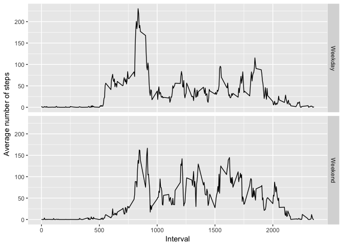

## Loading and preprocessing the data


```r
library(dplyr)
```

```
## 
## Attaching package: 'dplyr'
```

```
## The following objects are masked from 'package:stats':
## 
##     filter, lag
```

```
## The following objects are masked from 'package:base':
## 
##     intersect, setdiff, setequal, union
```

```r
library(ggplot2)

setwd("/Users/kyouannis/Documents/GitHub/RepData_PeerAssessment1")

unzip("./activity.zip")

activity<- read.csv("./activity.csv")
```

## What is mean total number of steps taken per day?


```r
dailysummary <- activity %>% 
  group_by(date) %>%
  summarise(total = sum(steps, na.rm = TRUE))

meansteps<- mean(dailysummary$total)

mediansteps<- median(dailysummary$total)
```

Histogram of the total number of steps taken each day:


```r
ggplot(dailysummary, aes(total)) +
  geom_histogram() +
  labs(x = "Total Daily Number of Steps", title = "Histogram of Daily Total Steps")
```

```
## `stat_bin()` using `bins = 30`. Pick better value with `binwidth`.
```

<!-- -->

Mean total number of steps taken each day: __9354.2295082__

Median total number of steps taken each day: __10395__

## What is the average daily activity pattern?


```r
timeseries<- activity %>%
  group_by(interval) %>%
  summarise(mean = mean(steps, na.rm = TRUE))

maxinterval <- timeseries %>% 
  arrange(desc(mean)) %>%
  select(interval) %>%
  head(n = 1)
```

Average number of steps taken by interval:


```r
ggplot(timeseries, aes(interval, mean)) +
  geom_line() +
  labs(x = "Interval", y = "Average number of steps")
```

<!-- -->

Interval __835__ contains the maximum number of steps on average across all days.

## Imputing missing values


```r
na_count<- sum(is.na(activity$steps))
```
Total number of missing values in the dataset (NAs): __2304__


```r
activity_imputed <- activity %>%
  group_by(interval) %>%
  mutate(steps_imputed = ifelse(is.na(steps), mean(steps, na.rm = TRUE), steps))
```


```r
dailysummary2 <- activity_imputed %>% 
  group_by(date) %>%
  summarise(total = sum(steps_imputed, na.rm = TRUE))

meansteps2<- mean(dailysummary2$total)

mediansteps2<- median(dailysummary2$total)
```

Histogram of the total number of steps taken each day:


```r
ggplot(dailysummary2, aes(total)) +
  geom_histogram() +
  labs(x = "Total Daily Number of Steps", title = "Histogram of Daily Total Steps")
```

```
## `stat_bin()` using `bins = 30`. Pick better value with `binwidth`.
```

<!-- -->

Mean total number of steps taken each day: __10766.19__

Median total number of steps taken each day: __10766.19__

When imputing the missing data, the mean and median total number of steps each day are higher.

## Are there differences in activity patterns between weekdays and weekends?


```r
timeseries2 <- activity_imputed %>%
  mutate(day = weekdays(as.Date(date))) %>%
  mutate(weekday = ifelse(day == "Saturday" | day == "Sunday", "Weekend", "Weekday")) %>%
  group_by(weekday, interval) %>%
  summarise(mean = mean(steps_imputed))
```


```r
ggplot(timeseries2, aes(interval, mean), color = weekday) +
  geom_line() +
  labs(x = "Interval", y = "Average number of steps") +
  facet_grid(weekday~.)
```

<!-- -->

